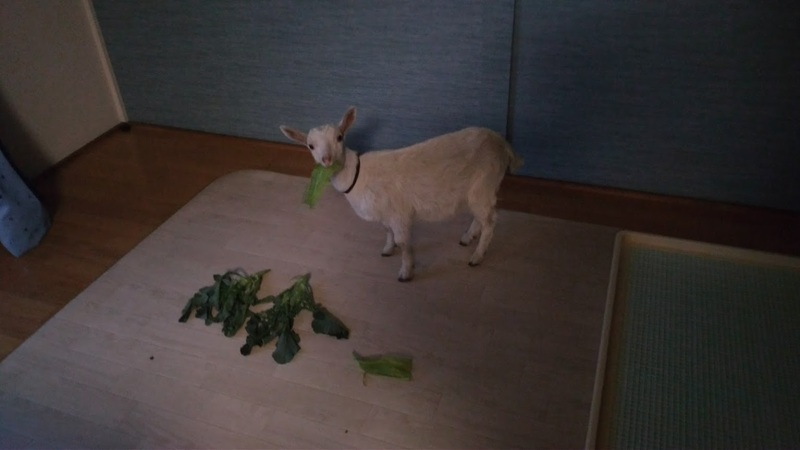
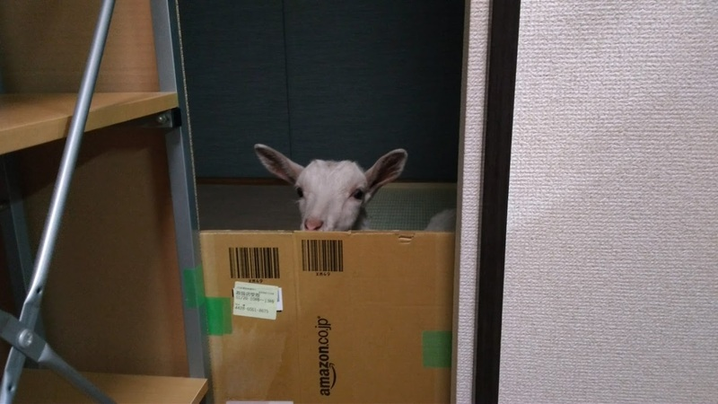
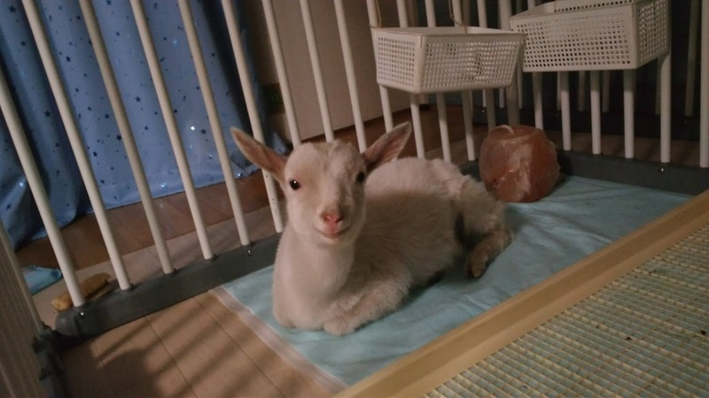
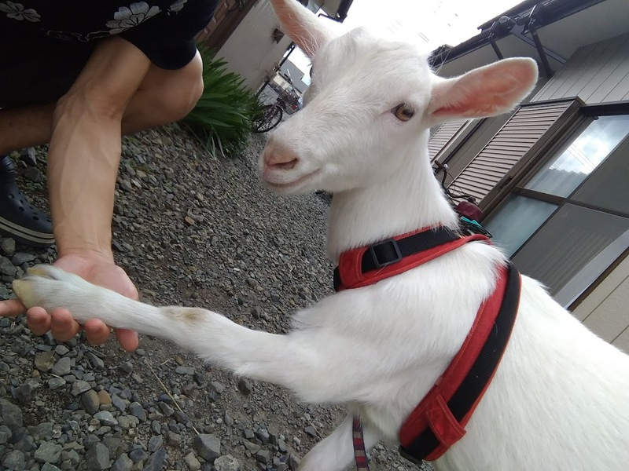
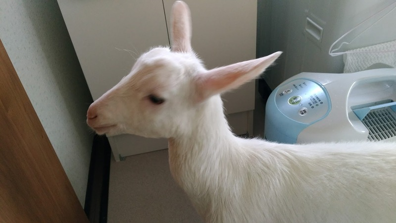
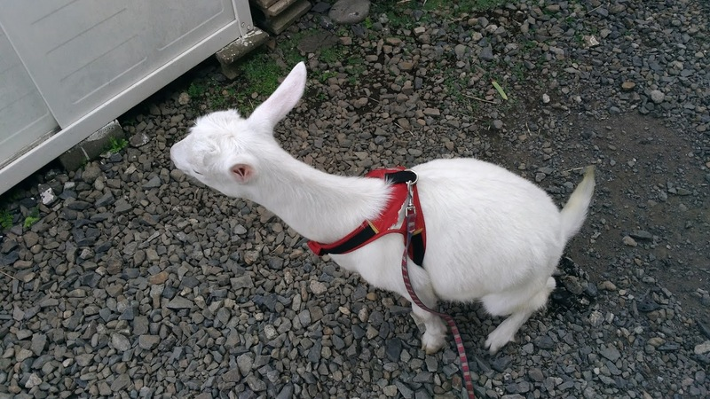

実はさくらちゃん（実ヤギ）はもういないんです。<!--more-->
すでに他界してしまって、さくらちゃん（偽ヤギ）と皆さんの心の中に生き続けています🌷

3年ほど前、さくらちゃんは3歳を目前にして突然の病で亡くなってしまいました。
ヤギさんの寿命が10年から15年と言われていることを考えると、早すぎる死でした。

ある日、家に帰るとさくらちゃんが妙に脅えた様子だったため「何だろう？」と原因を探ったところ、突然失明していました。
さらには翌朝には足腰が立たなくなり、食事もままならなくなりました。
当日の朝は特に変わった様子も見せなかったので、あまりの急変ぶりに驚いたものです。

急いで獣医さんに見てもらったものの、原因は不明でした。
獣医さんがアメリカの文献をあたったりして原因を調べてくれたものの、やはり事例が見つからない症状とのことで根本的な解決にはつながりませんでした。
日に日に衰弱していくさくらちゃんの看病を1ヶ月ほどつづけ、お別れの決意が固まったところで安楽死の決断をしました。
急死ではなかったのでお別れまでに覚悟を決める時間がありましたが、やはり最期のときは涙がポロポロ落ちました。

ヤギは家畜動物として飼われてきたため、愛玩動物として歴史のある犬や猫のように「お金をかけてでも治療する」という文化があまりありませんでした。
その結果として治療法も確立されておらず、そもそもヤギさんを診ることができる獣医さんが少ない現状です。
昨今はヤギさんを大切な家族として飼う方も増えてきましたから、これから少しずつ愛玩動物として飼育するための医療が発展していくことを願っています🌻

最後に秘蔵のさくらちゃん写真をお見せします🌹

* さくらちゃんが家族になった日
    
* まだ警戒しているさくらちゃん
    
* 後日ちょっと慣れてきたさくらちゃん
    
* ヒト・ヤギ友好条約の締結式
    
* 洗われたさくらちゃん
    
* おしっこするさくらちゃん
    
